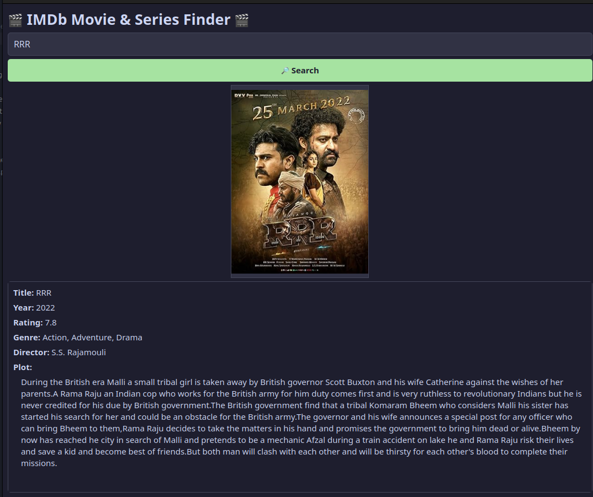

# 🎬 IMDb Movie & Series Finder

A lightweight desktop GUI application that allows you to search for movies and TV series using IMDb or OMDb data sources. It displays detailed information such as title, year, rating, genre, director, plot, and poster image in a clean, dark-themed graphical interface.

---

## 🚀 Features

- Search for movies or series by title.
- Displays poster, title, year, rating, genre, director, and detailed plot.
- Sleek dark-themed GUI interface.
- Uses API client (OMDb or IMDb) for reliable results.
- Built-in fallback scraper when API data is incomplete.
- Lightweight and beginner-friendly project structure.

---

## 📂 Project Structure

```
.
├── .gitignore
├── api_client.py      # Handles API requests for movie/series data
├── config.py          # Stores API keys and configuration constants
├── gui.py             # Builds and manages the graphical user interface
├── main.py            # Application entry point
├── requirements.txt   # Lists all Python dependencies
└── scrapper.py        # Fallback scraper to fetch data from IMDb pages
```

> ⚠️ Note: The file `scrapper.py` is intentionally spelled as such in this project.

---

## 🧾 Requirements

- Python 3.8 or higher  
- Internet connection for fetching data  
- Required Python libraries (listed in `requirements.txt`)

Example `requirements.txt`:
```
requests
Pillow
beautifulsoup4
lxml
tkinter   # Usually built-in; install via system package if missing
```

---

## ⚙️ Installation (Step-by-Step)

### 1. Clone the Repository
```bash
git clone https://github.com/<your-username>/imdb-movie-finder.git
cd imdb-movie-finder
```

### 2. Create and Activate a Virtual Environment

**For Linux/macOS:**
```bash
python3 -m venv .venv
source .venv/bin/activate
```

**For Windows (PowerShell):**
```powershell
python -m venv .venv
.venv\Scripts\Activate.ps1
```

### 3. Install Dependencies
```bash
pip install -r requirements.txt
```

> On Ubuntu/Debian, install tkinter via:
> ```bash
> sudo apt install python3-tk
> ```

---

## ⚙️ Configuration

Edit `config.py` to add your API key and other settings:

```python
# config.py

OMDB_API_KEY = "your_omdb_api_key_here"
OMDB_BASE_URL = "http://www.omdbapi.com/"
DEFAULT_POSTER_PLACEHOLDER = "ss.png"
REQUEST_TIMEOUT = 10  # in seconds
```

To use environment variables:
```python
import os
OMDB_API_KEY = os.getenv("OMDB_API_KEY")
```

Set your key before running:
```bash
export OMDB_API_KEY="your_api_key"
```

---

## ▶️ Run the App

```bash
python main.py
```

Once launched, type a movie or series name (e.g., “RRR”) and press **Search**.  
Results including the poster and details will appear below.

---

## 🧠 How It Works (Internals)

| File | Description |
|------|--------------|
| **main.py** | Entry point — loads config and starts GUI |
| **api_client.py** | Sends HTTP requests to OMDb or IMDb and parses JSON |
| **scrapper.py** | Scrapes IMDb HTML pages if API data is missing |
| **gui.py** | Builds and controls the Tkinter GUI layout and components |
| **config.py** | Stores API keys and configuration constants |
| **.gitignore** | Ignores unnecessary files like `__pycache__`, `.venv`, etc. |

---

## 🖼️ Screenshots

Example output (for the movie **RRR**):



---

## 🧩 Troubleshooting

| Issue | Solution |
|--------|-----------|
| `tkinter` not found | Install it using `sudo apt install python3-tk` |
| Poster not showing | Verify your API key and internet connection |
| API key errors | Check OMDb API key validity and daily quota |
| Unicode issues | Use UTF-8 encoding or sanitize text before display |

---

## 🧪 Testing

Run the following tests manually:

1. Search for "RRR" → should display details and poster.  
2. Disconnect the internet → app should handle it gracefully.  
3. Modify `api_client.py` → test API error handling.

Automated testing (optional):
```bash
pytest
```

---

## 💡 Future Improvements

- Add movie rating graphs or actor bios.  
- Add search suggestions/autocomplete.  
- Save recent searches locally.  
- Support multiple APIs (OMDb, TMDb).  
- Package app as `.exe` or `.deb` using PyInstaller.

---

## 🤝 Contributing

1. Fork the repository.  
2. Create a new branch:  
   ```bash
   git checkout -b feature/my-feature
   ```  
3. Commit and push your changes.  
4. Create a pull request explaining your changes.

---

## 🪪 License

This project is licensed under the **MIT License**.  
You are free to use, modify, and distribute this code with proper attribution.

---

**Developed by:** *Rohit Kumar Yadav*  
**Language:** Python 🐍  
**Framework:** PyQt6  
**Version:** 6.9.1  
